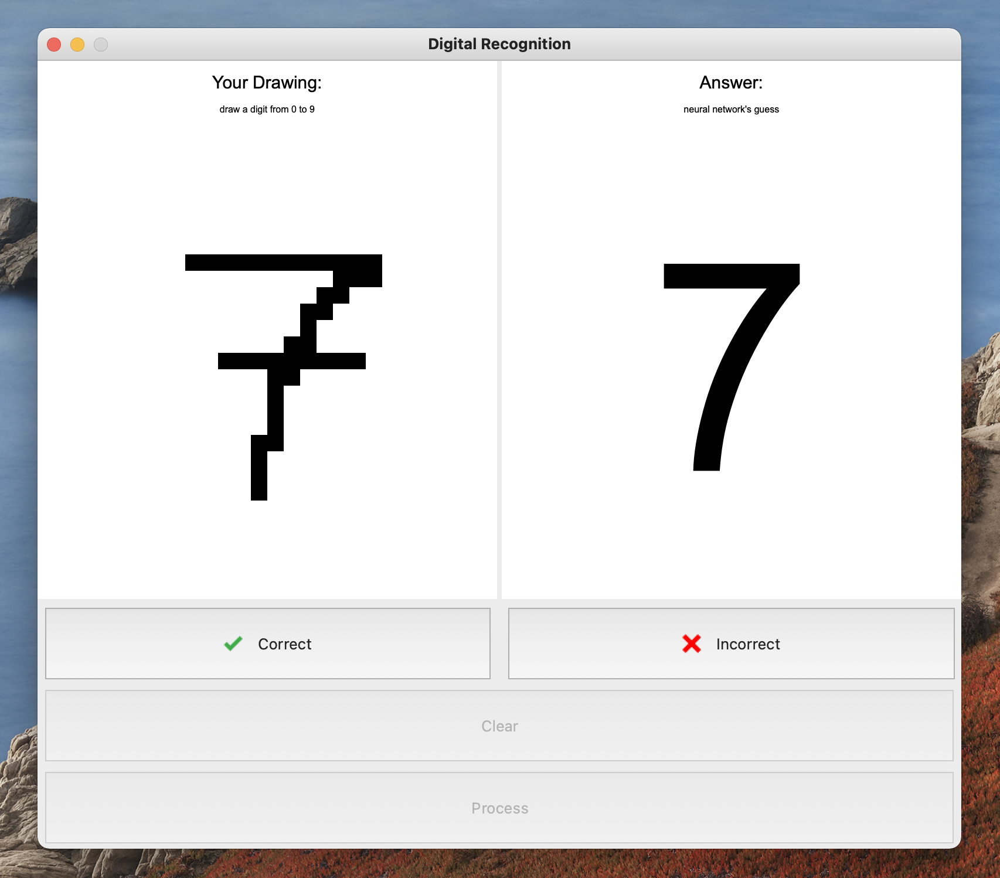

# Digit-Guesser

Digit Guesser is a Python GUI that guesses user's handwritten digits using a neural network.

## Interface

The GUI is made using PyQt5. After the user draws a digit in an integrated graphic field and clicks "Process", the neural network processes the drawing and the GUI displays its guess in a separate field. Each new drawing is used to train the neural network starting from the next script launch. If the guess was incorrect, the GUI also allows the user to chose what they meant to draw.

## Neural network

The neural network created for this project was inspired by Make Your Own Neural Network by Tariq Rashid. It initially used MNIST training set, further replaced by my own [knowledgex.csv](knowledgex.csv) dataset for setup. The script updates the dataset with new examples each time the interface is used.

## DigitalLearning.py

Neural network requires a lot of examples to work properly. To make the teaching process even easier for the user, I developed a supplementary GUI called [DigitalLearning.py](DigitalLearning.py) that asks the user to draw digits it requires for more accurate recognition.

## License

[MIT](LICENSE)
